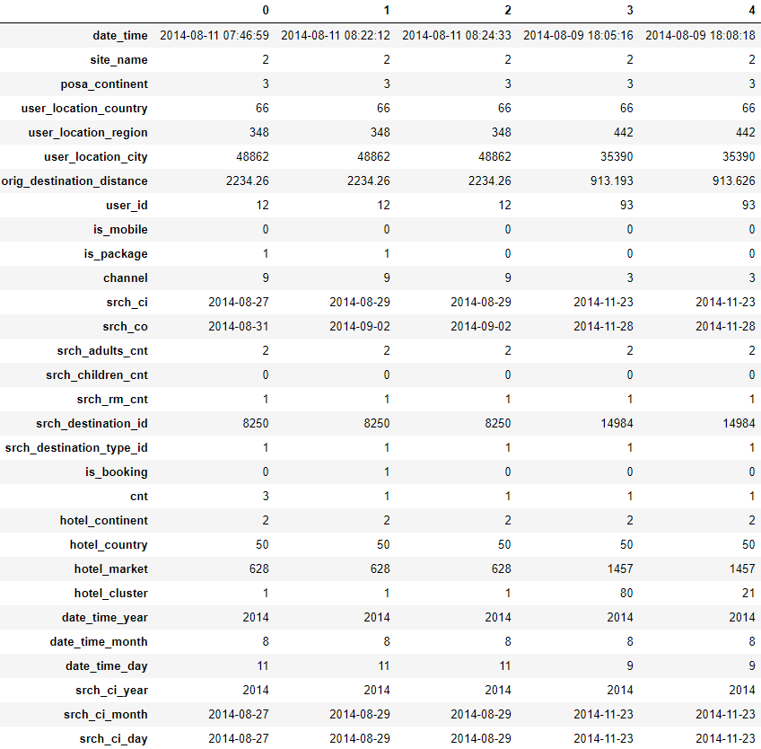
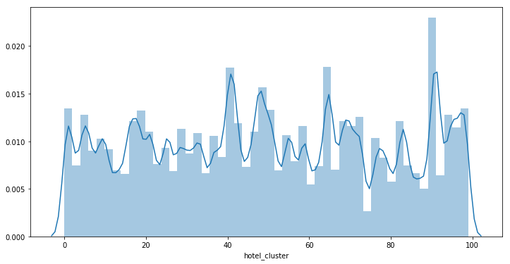
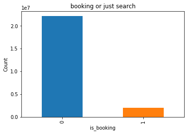
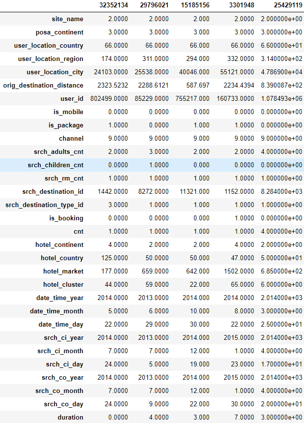
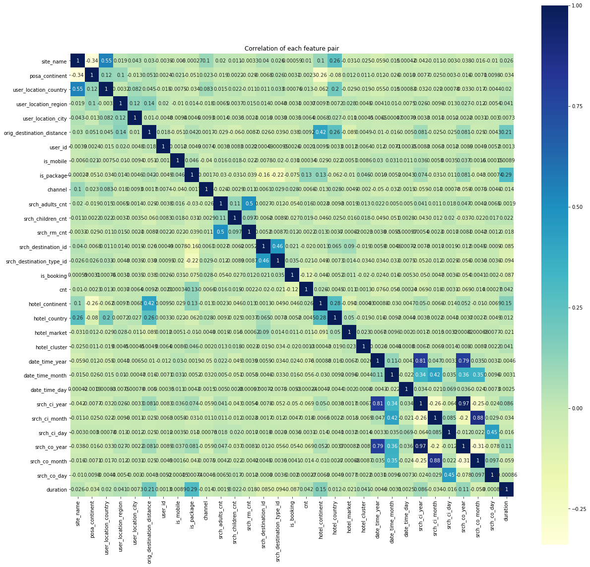
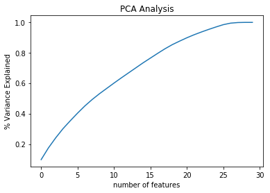

# Hotel Recommendation System Based on Both Hotel Popularity and User Preferences

### Overview

[Competition page](https://www.kaggle.com/c/expedia-hotel-recommendations).

With the rapid development of Internet of Things and Big Data, people nowadays can access various of resources of different form, e.g. books, music, videos, and so on. On the other hand, it rises a problem that too many choices of resources make people hard to select most suitable ones for themselves. A recommender system, also known as a recommendation system, solves this problem by providing suggestions of items for users. Recommendation systems are used in a variety of areas, such as movies, books, online shopping, social media, research articles, etc.

Most of existing hotel recommendation systems being used by hotel booking websites (booking.com, expedia.com, hotels.com, etc.) provide results only based on the properties of the hotels in a destination specified by the user. Those hotels with higher ratings and better locations are usually listed in the top of the searching result. The goal of this project is to develop a recommendation system that consider both the hotel properties and user preferences to provide more suitable suggestions to users.


### Dataset

Expedia aims to challenge competitors to predict the likelihood a user will stay at 100 different hotel groups, i.e. there are 100 pre-defined classes in the dataset. Consequently, a multi-class prediction is needed in the project. In total, 37,670,293 instances are included in the training set, which is a huge dataset. In most cases during the project, 1% (or even less) randomly selected instances are being used. There are 24 features in the training set, brief descriptions are as follows.

- date_time: the date and time a user search for a hotel.
- site_name: ID of different Expedia websites, for example, expedia.co.uk is for users who live in the UK, etc.
- posa_continent: the corresponding continent for the website.
- channel: ID of a marketing channel.
- user_location_county: the country ID of the user.
- user_location_region: the region ID of the user.
- user_location_city: the city ID of the user.
- orig_destination_distance: the distance between the user and the destination. A Null value indicates that the distance cannot be calculated since the user and the destination are in different continents.
- user_id: user ID.
- is_mobile: this is a Boolean value, 1 indicates that the user is connected with a mobile device, 0 means otherwise.
- is_package: a Boolean value, 1 indicates that the user is search a travel package (e.g. flight + hotel, flight + car rental, etc.), 0 means otherwise.
- srch_ci: hotel check-in date specified by the user.
- srch_co: hotel check-out date specified by the user.
- srch_adults_cnt: number of adults specified in the search.
- srch_children_cnt: number of children specified in the search.
- srch_rm_cnt: number of rooms specified in the search.
- srch_destination_type_id: type ID of the destination.
- hotel_continent: the continent ID where the hotel locates.
- hotel_country: the country ID where the hotel locates.
- hotel_market: the market ID of the hotel.
- is_booking: a Boolean value, 1 indicates that the user booked the hotel, 0 means that the user only clicked and viewed the hotel.
- cnt: number of similar events in the same user session.
- hotel_cluster: class ID of the hotel.

Example of how these data looks like in the dataset:



The figure below shows the overall view of how each hotel cluster distributed in the dataset. Each bar represents one cluster, and the height of the bar shows probability of that cluster in the whole dataset. As can be seen in the figure, the distribution of each class is very uniform.



As for binary classification, the distribution of whether the user booked or just clicked the hotel is also of interest. Below shows the number of bookings verses the number of searches. The data is obviously unbalanced, which will be dealt with later.



#### Additional dataset: Destinations

Expedia also provides another dataset called Destinations, in which there are 62,106 different destinations defined by Expedia, each with 149 features containing latent descriptions of the corresponding destination, as can be seen as follows. It is not clear what information is indicated by these latent descriptions, however they will be combined with the training set for analysis in the project.


### Methods

In this part, two types of methods will be introduced to analyze the dataset and make predictions. As mentioned in previous sections, there are 100 hotel classes and information of user behavior as well as the hotel properties, several multi-class models will be implemented to predict which hotel class is more likely to be chosen by a user. Another type of method is to develop a binary classification model, which predicts whether a user is going to book or just browse the hotel. 

#### Pre-processing

Some of the data in the original dataset cannot be used directly. For example, date_time, srch_ci, and srch_co are in date and/or time format, which is not compatible for directly analysis. Functions are written to extract day, month, and year information from these date data. Furthermore, based on the extracted data, a new feature named ‘duration’ representing the number of days of stay is calculated based on the extracted date information. Finally, to prevent duplication, features date_time, srch_ci, and srch_co are deleted from the dataset, since better alternatives have been generated to represent them.

Second, there are a certain portion of Null values in the dataset. There instances are simply dropped out from the dataset since the number of remaining instances is sufficiently large for analysis. Up to this step, the resulting dataset looks like what is shown below.




In addition, based on the srch_destination_id feature, the Destination dataset containing those latent descriptions are also merged into the original dataset.

Above are all the steps for pre-processing. After that, we tried to look for any useful information by calculating the correlations. First the correlation between hotel_cluster and all other features is calculated as follows:

 ```
srch_destination_type_id    -0.033605
site_name                   -0.024707
is_booking                  -0.020079
user_location_country       -0.019285
srch_destination_id         -0.018918
hotel_country               -0.018657
srch_co_month               -0.008744
srch_ci_month               -0.006926
date_time_month             -0.004429
date_time_year              -0.002550
srch_rm_cnt                 -0.002347
channel                     -0.001966
hotel_continent             -0.000434
user_location_city           0.000453
date_time_day                0.000797
cnt                          0.001294
srch_ci_day                  0.001383
srch_co_day                  0.002204
user_location_region         0.004527
orig_destination_distance    0.004927
user_id                      0.006396
srch_ci_year                 0.006689
srch_co_year                 0.007957
is_mobile                    0.008554
posa_continent               0.010802
srch_adults_cnt              0.013056
srch_children_cnt            0.017822
hotel_market                 0.023229
duration                     0.041439
is_package                   0.046408
hotel_cluster                1.000000
 ```

There seems no direct linear relationship between the hotel_cluster and all other features. Then a correlation among all features are generated as a heat map, see the following figure. The darker the color of a cell, the higher the correlation between corresponding features. Except those features representing the year and month of the search, there is also no significantly correlated features. As a result, we chose several multi-class classification methods to do the analysis. The results and comparisons will be presented in upcoming sub-sections.




#### Multi-class models

First, we built several multi-class models (Naïve Bayes, KNN, Random Forest, Multi-class Logistic Regression, and SVM) to predict the instances. The experiments are done on booking examples.


#### Binary-class models

In addition to the multi-class models, another binary prediction model is implemented to predict whether a user will book or just click a hotel. As can be seen that the numbers of booking and click-only examples are too unbalanced, which will have a huge impact of how well the model trains, another dataset is generated to deal with this problem. This new dataset set contains all the booking instances, and the same number of click-only instances. The is_booking feature is used as the prediction labels, and the remaining part of the dataset is for training. Since there are too many features in the dataset, a dimensional reduction method is needed. As a simple approach, we use PCA to see the importance of each feature, the result can be viewed in the figure below.



According to the elbow principle, the number of principle components of the targeting dimension is set to 25. After performing PCA, the resulting dataset is then split into training set and testing set, with 80% and 20% separation size, respectively. Another random forest classifier (binary) is built with the maximum depth set to 2. The model returns following result

| Accuracy | Precision | Recall | F-score |
| -------- | --------- | ------ | ------- |
| 0.624    | 0.607     | 0.736  | 0.665   |


### Results

Here is a result summary of different classification models.

| Model                             | Accuray |
| --------------------------------- | ------- |
| Naïve   Bayes                     | 0.144   |
| KNN                               | 0.442   |
| Random   Forest                   | 0.392   |
| Multi-class   logistic regression | 0.465   |
| SVM                               | 0.491   |

As can be seen in the results table, SVM achieves the best accuracy (0.491), which still has space to improve, since most teams of the Kaggle competition reach accuracies above 0.5, and the winner team has an accuracy of 0.60218. We suggest do more feature engineering to optimize the results.